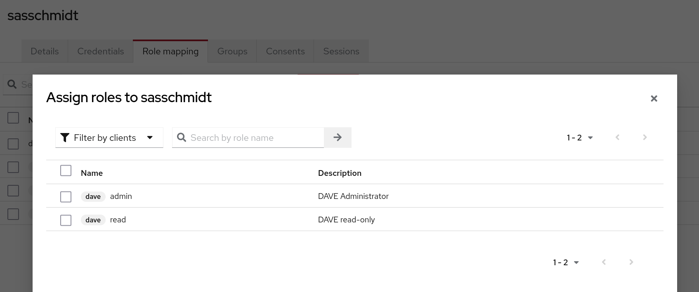

[.title]
= The Evolution of Authentication
Sascha Schmidt & Felix Peters

// Intro / Names / Company
A Keycloak Success Story 

:revealjs_theme: white
:customcss: custom.css
:revealjs_history: true
:icons: font
:revealjs_totalTime: 900
:source-highlighter: highlight.js

== Origins: Our Starting Point

[%step]
* Emergence from a fragmented landscape of user pools and varied credentials
* Challenges in onboarding and offboarding experiences
* Issues stemming from reused passwords
* Inconsistent password strength
* Lack of comprehensive audit trails

[%notitle]
=== MFA

[%step]
* Limited to no utilization of multifactor authentication
* Dependence on LDAP with globally shared groups across applications
* Direct login through application interfaces

[%notitle]
[%auto-animate,auto-animate-duration=2]
=== Hope
// Just a little bit of animation foo
*However, there is a light at the end of the tunnel!*

[%notitle]
[%auto-animate,auto-animate-duration=2]
=== Hope-2

*However, there is a light at the end of the tunnel!*

We're here to guide you through the path to liberation.

== Introducing: Breuninger ID

=== The Vision 
[.notes]
--
--

* End-to-End Self service (Details in the following slides)
* The Least Privilege by default
* Automatable and secure
* OIDC/SAML (vs LDAP)
* Consistent Login (vs by Application)
* Client Roles (vs global LDAP groups)

== Streamlining Responsibilities

[.notes]
--
* In the upcoming slides, I'll discuss how we successfully streamlined responsibilities, ensuring that everyone is tasked with roles they are genuinely equipped to manage effectively.
--

== The Operator

[.notes]
--
* What expertise does an operator typically possess?
* *Maintenance:* Conducting maintenance activities, such as updating software and its dependencies to ensure system reliability and performance.
--

=== Maintenance

Renovate

Keep track of all dependencies

image::images/maintenance-renovate.png[]

[.notes]
--
* To keep track of all the updates we are using renovate.
  * Renovate automatically opens merge requests in our git repository for every update.
--

=== Maintenance

Automate everything

Tests => Merge => Release => Rollout

image::images/pipeline.png[]

[.notes]
--
* We have automated pipelines and tests in place that will automatically test every merge request
* If the pipeline succeeds the merge request will automatically be merged to master
* On the master branch a new release will automatically be produced using semantic release
* This release is going to be deployed to production automatically
--

=== Monitoring

image::images/monitoring.png[]

[.notes]
--
* Setting up and fine-tuning monitoring systems to proactively identify potential issues or to ensure critical problems do not go unnoticed.
* We are using prometheus and grafana for that purpose
* We keep track of logins per client, http errors, login errors and response times
* If for example the login error rate goes up really quickly we fire an alert so the operator can make sure keycloak still behaves
--

== The Developer

[.notes]
--
* Developers are the ideal choice for client onboarding, thanks to their in-depth knowledge of OIDC/SAML implementations, which ensures a seamless and tailored integration for each client.
* A well-defined user model, complete with consistent attributes, facilitates a more organized and efficient onboarding experience.
--

=== The Developer

Client configuration and onboarding

image::images/client-manifest.png[]

[.notes]
--
* To simplify the process, we developed a solution named "The Client Factory."
** Developers can submit their client configuration by creatign a pull request
** We utilized `jsonschema` to establish a Kubernetes-style manifest for clients, ensuring structured and consistent client configurations.
** Clients can be categorized as either managed or unmanaged:
*** Managed clients are fully configured via these manifests, offering a hands-off approach for seamless integration.
*** Unmanaged clients receive only the essential setup from the factory, leaving the finer details of configuration to the application owner's discretion.
--

== The Application Owner

[.notes]
--
* Only the application owner has the necessary insight to reasonably determine access privileges for their application, making them uniquely qualified for this responsibility—neither helpdesk staff nor operators are equipped to make these decisions.
--

=== The Application Owner

Self-Service

image::images/keycloak-client-1.png[]

[.notes]
--
* Using fine grained permissions this can be done using the keycloak console.
--

=== The Application Owner

Manage Roles

image::images/keycloak-client-2.png[]

[.notes]
--
--

=== The Application Owner

Assign Roles

[.notes]
--
--

== The User

The last login form

image::images/login.png[width="50%"]

[.notes]
--
* This is the only login screen an employee at Breuninger should ever face
* The login will always be under the same URL
* When ever he is confronted with a different type of login form he should immediately get suspicious

* Configure / show several MFA mechanisms
--

== Conclusion

Punch-Line→ (Was ist unsere Message? You can do it!)

[.notes]
--
--

[%notitle]
== hiring

We are hiring!
