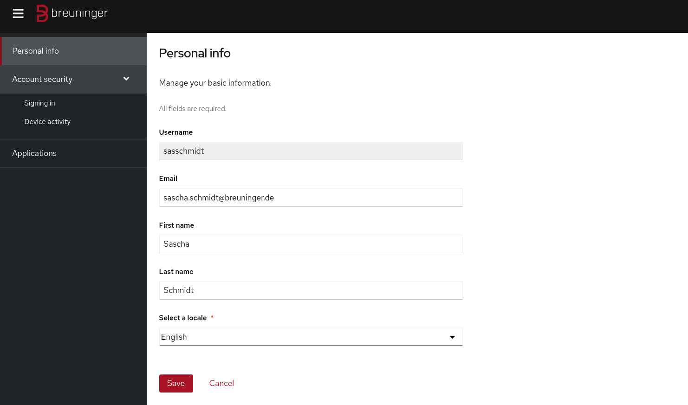

[.title]
= The Evolution of Authentication
Sascha Schmidt & Felix Peters - E. Breuninger GmbH & Co

// Intro / Names / Company
A Keycloak Success Story 

:revealjs_theme: white
:customcss: custom.css
:revealjs_history: true
:icons: font
// 20 minutes
:revealjs_totalTime: 1200
:source-highlighter: highlight.js
:revealjs_transition: slide

:revealjs_width: 1200

:revealjs_pdfseparatefragments: false

== Origins: Our Starting Point

[%step]
* Emergence from a fragmented landscape of user pools and varied credentials
* Inconsistent authentication strength
* Challenges in onboarding and offboarding experiences
* Manual tasks for Helpdesk and Support personnel
* Lack of comprehensive audit trails

[.notes]
--
* Short wrap up of the histroy and groth, digitalization of fashion and online sales.
* From a local on side retailer to an european ecommerce bussiness
** Several yeas ago, there was Lotus Notes and Blackberries
** Now we have a service landscape base don the old wold of authentication
--

=== But there is more...

[%step]
* Limited to no utilization of multifactor authentication
* Dependence on LDAP with globally shared groups across applications
* No implementation of the principle of least privilege.

[%step]
__The antithesis of modern IT security__ 😞

[.notes]
--
* This is bad - but quiet common for small and medium sized companies
* Traditional setup with Active Directory, Windows-centric, handicrafted.
* That has evolved historically, and we don't want to blame anyone.
* Everyone told us - This is not solveable. 

**Action: Raise your hand if you have ever been in a similar situation!**
--

[%notitle]
[%auto-animate,auto-animate-duration=2]
=== Hope
// Just a little bit of animation foo
*There is a light at the end of the tunnel!*

[%notitle]
[%auto-animate,auto-animate-duration=2]
=== Hope-2

*There is a light at the end of the tunnel!*

We're here to guide you through the path to liberation.

== Introducing: Breuninger ID

[%step]
* Transitioning from LDAP to OIDC/SAML for enhanced security
* End-to-End Self Service - from onboarding to offboarding
* Consistent login experience across platforms
* Implementing self-managed client roles to replace global LDAP groups
** Embracing Least Privilege by Default
* Enabling multifactor authentication

[%notitle]
=== The Solution

image::images/Keycloak-logo.png[alt=Keycloak]

[.notes]
--
* Handover to Sascha after this slide
** He goes into detail on how we implement this vision
** Our key benefits from using a open solution like keycloak
--

// Handover to Sascha

== Streamlining Responsibilities

[.notes]
--
* On the upcoming slides, I'll talk about how we successfully streamlined responsibilities, ensuring that everyone is tasked with roles they are genuinely equipped to manage.
* Übersicht darüber wie wir die Verantwortlichkeiten so optimiert haben dass jeder die Aufgaben bekommt für die er die Verantwortung übernehmen kann
--

Enhance overall security by optimizing responsibilities for each role

== 👨🏼‍🔧 The Operator

[.notes]
--
* What expertise does an operator typically possess?
* I'd say it is conducting maintenance activities, such as updating software and it's dependencies to ensure system reliability and performance.
* Welche Skills erwarten wir in der Regel von einem Operator?
* Ich würde sagen, Konfiguration, Betrieb und Wartung von Services
--

=== Dependencies

Renovate - Keep track of all dependencies

[.notes]
--
* To keep track of all the *dependencies like Container, Operator Lifecycle Manager, Maven* et cetera and their updates we are using renovate.
  * Renovate *automatically opens merge requests* in our git repository for every update.
--

=== Rollout

Automate everything

Tests => Merge => Release => Rollout

[.notes]
--
* We have *automated pipelines and tests* in place that will automatically test every merge request
* For *minor and patch updates*, if the pipeline succeeds the merge request will *automatically be merged* to master
* On the master branch a *new release will automatically* be produced using *semantic release*
* This release is going to be *deployed to production automatically*
--

=== Observability

image::images/monitoring.png[]

[.notes]
--
* To identify *potential issues* and to ensure *critical problems* do not go unnoticed we set up and fine tuned a monitoring system.
* We are using *prometheus and grafana* for that purpose
* We keep *track of logins per client*, *http errors*, *login errors* and *response times*
* If for example the *login error rate goes up really quickly* we fire an alert so the operator can make sure keycloak still behaves
--

== 👨‍💻 The Developer

[.notes]
--
* Developers are the *deal choice for client onboarding*, thanks to their *in-depth knowledge of OIDC/SAML* implementations, which ensures a seamless and tailored integration for each client.
* A *well-defined user model*, complete with *consistent attributes*, ensures a more organized and efficient onboarding experience.
--

=== The Developer

Client configuration and onboarding

image::images/client-manifest.png[[alt=Renovate,height=500]

[.notes]
--
* To simplify the process, we developed a solution named "*The Client Factory.*"
** *Developers* can submit their *client configuration* by creatign a *pull request*
** We utilized *`jsonschema`* to establish a *Kubernetes-style manifest for clients*, ensuring structured and consistent client configurations.
** Clients can be categorized as either *managed or unmanaged*:
*** *Managed* clients are *fully configured* via these manifests, offering a hands-off approach for seamless integration.
*** *Unmanaged* clients receive only the *essential setup from the factory*, leaving the finer details of configuration to the application owner's discretion.
--

== 👨‍💼 The Application Owner

[.notes]
--
* Only the *application owner* has the necessary insight to reasonably determine access privileges for their application, making them uniquely qualified for this responsibility—neither helpdesk staff nor operators are equipped to make these decisions.
* hat notwendige Einsicht um Zugriffsberechtigungen vernünftig festzulegen
* Weder Helpdesk-Mitarbeiter noch Operator sind in der Lage diese Entscheidungen zu treffen
--

=== Self-Service

On- and Off-boarding

image::images/keycloak-client-1.png[[alt=Renovate,height=500]

[.notes]
--
* Using fine grained permissions the onboarding and - probably more important - the offboarding can be done using the keycloak console.
* onboarding / offboarding(!) kann in der Keycloak Console umgesetzt werden
--

=== Manage Roles

Grant or revoke privileges

[.notes]
--
* As an *application owner* you probably do *not* want to grant *equal rights* to everyone.
* And thats fine as long as there is a *technical reason*.
* Using Keycloak the application owner can do that him self.

--

== 🙋‍♂️ The Employee

[.notes]
--
* You want your users to *not reuse credentials on multiple userbases*
* *Classic LDAP* integration makes it hard for the user to figure out wether to use their company credentials or when they need to use individual credentials.
--

=== The last login form

[.notes]
--
* This is the *only login screen* an employee at Breuninger should ever face
* The login will always be under the *same URL*
* When ever he is confronted with a *different type of login* form he should immediately get *suspicious*
--

=== Personal Information

Update personal information

[.notes]
--
* Employees get enabled to update their personal information like their name or the preferred language.
* Though, honestly, it usualy makes more sense to update things like the name via the HR department.
--

=== Update Credentials

Change password, configure MFA

[.notes]
--
* The user can as well change their password or add multi factor devices like TOTP applications or passkeys themself.
--

== Conclusion

Our Accomplishments

[%notitle]
== Conclusion-content

* **Enhanced Security Through Role Streamlining**: +
  Ensuring Comfort and Efficiency for All
* **Automation Drives Security:** +
  Eliminating Manual Tasks, Empowering Every Role
* **User-Centric Security:** +
  Simplified Access with a Single Sign-On Solution

**Keycloak: The Foundation Enabling Our Success**

[.notes]
--
--

== You can do it too!
